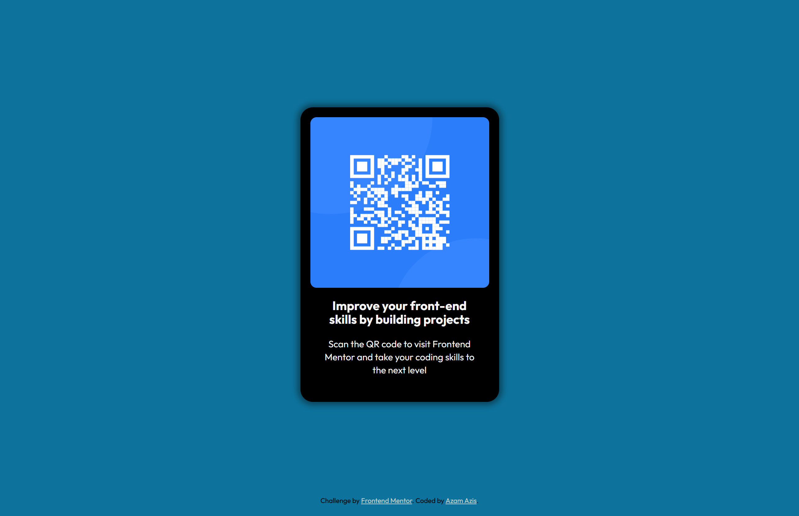

# Frontend Mentor - QR code component solution

This is a solution to the [QR code component challenge on Frontend Mentor](https://www.frontendmentor.io/challenges/qr-code-component-iux_sIO_H). Frontend Mentor challenges help me improve my coding skills by building realistic projects.

## Table of contents

- [Frontend Mentor - QR code component solution](#frontend-mentor---qr-code-component-solution)
  - [Table of contents](#table-of-contents)
  - [Overview](#overview)
    - [Screenshot](#screenshot)
    - [Links](#links)
  - [My process](#my-process)
    - [Built with](#built-with)
    - [What I learned](#what-i-learned)
    - [Continued development](#continued-development)
    - [Useful resources](#useful-resources)
  - [Author](#author)

## Overview

I completed the QR code component challenge from Frontend Mentor, where the goal was to create a simple card layout based on figma design using HTML and CSS. The project focused on building a clean and responsive UI while matching the design as closely as possible.

### Screenshot



### Links

- Solution URL: [Add solution URL here](https://your-solution-url.com)
- Live Site URL: [Add live site URL here](https://your-live-site-url.com)

## My process

### Built with

- Semantic HTML5 markup
- CSS custom properties
- Flexbox
- Mobile-first workflow

### What I learned

I learned to write HTML and CSS; structuring HTML (using elements like div, img, h1, and p), styling with CSS (centering elements with flexbox, applying responsive design, etc).

```html
<div>
  
  <h1>Hello world!</h1>
  <p>I learn to code</p>
</div>
```

```css
.my-css {
  color: skyblue;
  display: flex;
  justify-content: center;
}
```

### Continued development

- Improve responsiveness for different screen sizes
- Write cleaner HTML and CSS

### Useful resources

- [https://learn.shayhowe.com/](https://learn.shayhowe.com/) - This helped me to understand HTML and CSS for the very first time. I really liked this pattern and will use it going forward.
- [https://www.w3schools.com/](https://www.w3schools.com/) - This is an amazing article which helped me finally understand HTML and CSS. I'd recommend it to anyone still learning this concept.

## Author

- GitHub - [Azam Azis](https://github.com/AzamAzis)
- Frontend Mentor - [@AzamAzis](https://www.frontendmentor.io/profile/AzamAzis)
